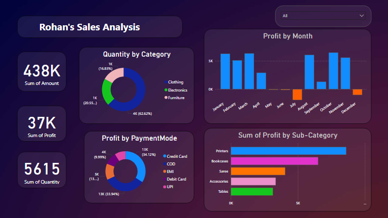

# 📊 Sales Analysis Dashboard – Internship Day 2

## 🔹 Key Features

- **Charts Used**:
  - Quantity by Category (Pie)
  - Profit by Month (Bar)
  - Profit by Payment Mode (Donut)
  - Profit by Sub-Category (Bar)
- **Interactive Filter**: Dropdown slicer for dynamic data exploration

## 🛠 Tools Used

- Power BI Desktop  
- DAX Measures  
- Custom Dark Theme

## 📸 Preview

## 🚀 Insights

This dashboard is designed to uncover hidden patterns in a company’s sales data. Starting with an overview of essential performance metrics, the analysis dives into how various product categories are performing, how profit fluctuates over months, which payment methods drive the most revenue, and which sub-categories contribute most to net profitability.

