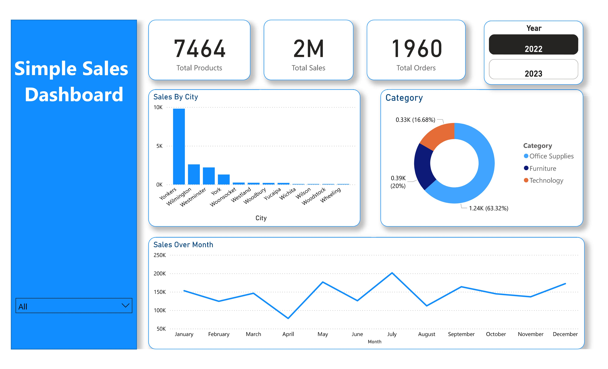

# 📊 Internship Day 8 - Sales Dashboard |

## ✅ Task of the Day:
On the 8th day of my internship, I worked on building a **Simple Sales Dashboard** using Power BI. The dashboard provides a clear and interactive overview of product sales data.

## 🛠️ What I Did:
- Imported and cleaned the dataset.
- Converted date columns to proper datetime format.
- Designed a visually appealing dashboard with cards, charts, and slicers.

## 📷 Dashboard Preview:

## 📌 Key Learnings:
- Practiced Power BI data modeling and transformation.
- Understood DAX basics for calculating KPIs.
- Improved visual storytelling with dashboard layout techniques.

